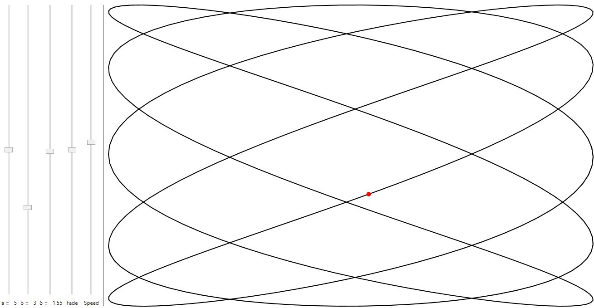
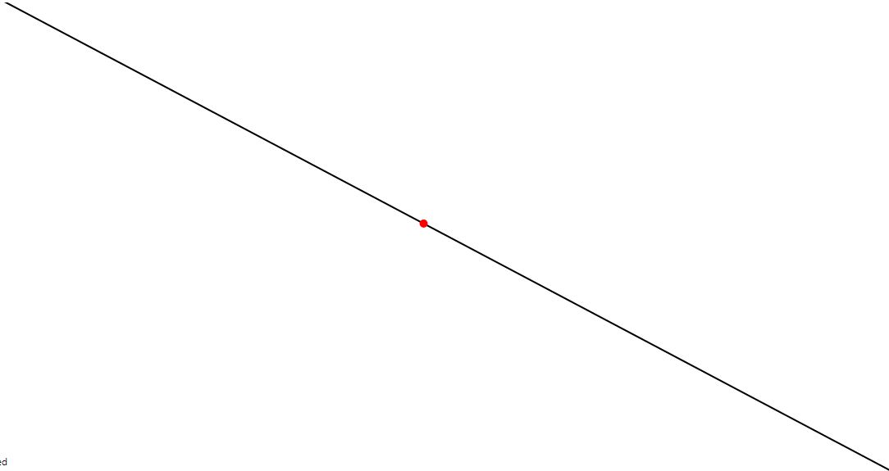
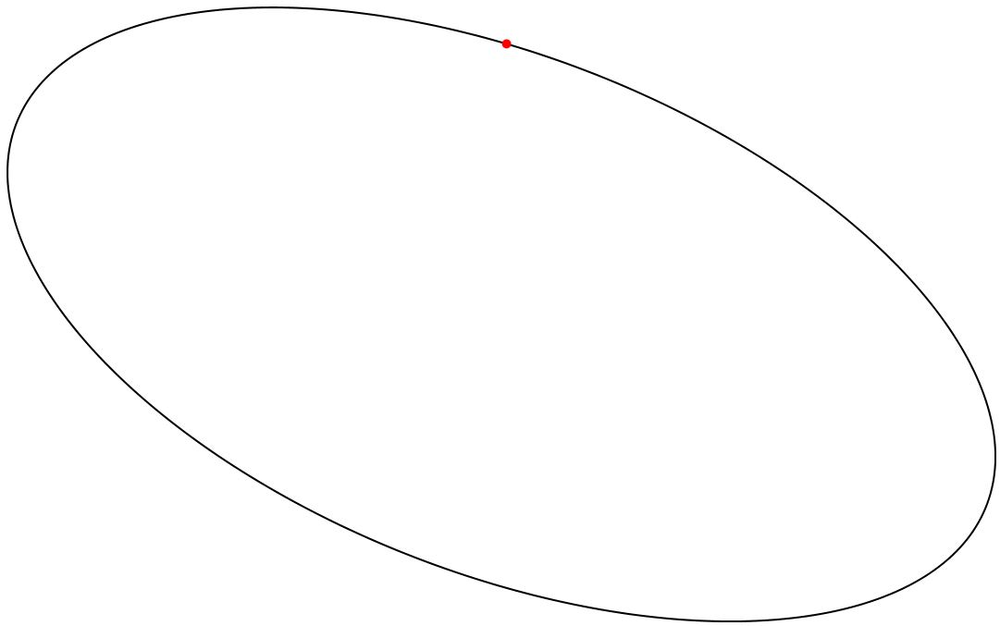

# Lissajous Curve

Lissajous curve represents a harmonic motion. It is described by the parametric equations:

$x=A\sin(at+\delta )$ 
$y=B\sin(bt)$

## Examples

### Line
$a = 1$
$b = 1$
$δ = 0$

### Ellipse
$a = 1$
$b = 1$
$δ \neq 0$

### Parabola
$a = 2$
$b = 1$
$δ = π / 2$

## :link: Useful links
* [Lissajous Curve on Wolfram Math World](http://mathworld.wolfram.com/LissajousCurve.html)