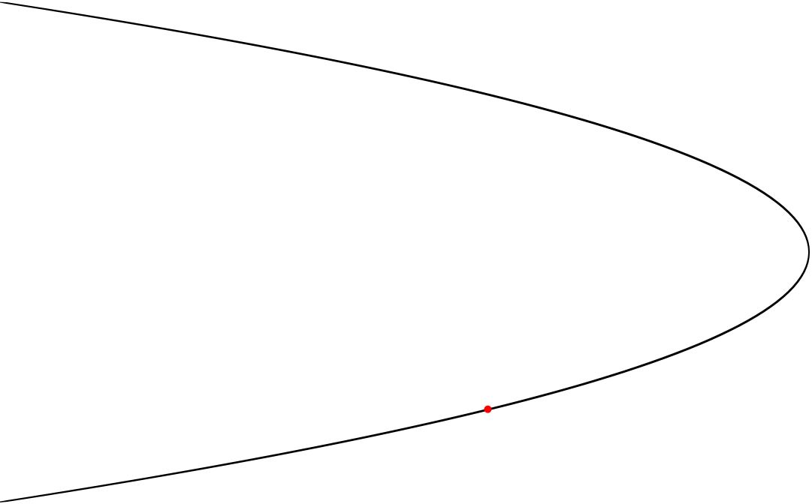

# Lissajous Curve

Lissajous curve represents a harmonic motion. It is described by the parametric equations:

## Examples

### Line

### Ellipse

### Parabola

## :link: Useful links
* [Lissajous Curve on Wolfram Math World](http://mathworld.wolfram.com/LissajousCurve.html)
